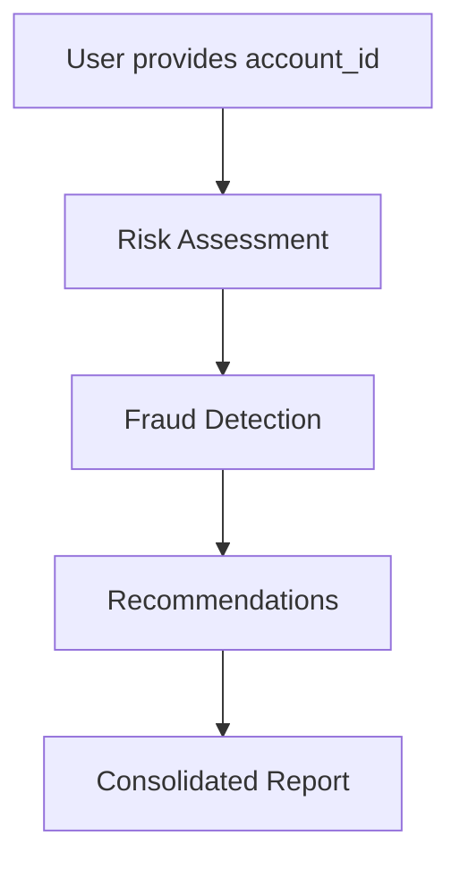

# Financial Risk Management - watsonx Orchestrate Deployment Guide

This guide provides step-by-step instructions to deploy 4 financial risk analysis tools and 1 orchestrator agent to watsonx Orchestrate using the ADK.

## 📋 Overview

### Tools to Deploy (4 OpenAPI Tools)
1. **Transaction Analysis Tool** - Analyzes transactions with anomaly detection and AML pattern identification
2. **Risk Assessment Tool** - Assesses overall account risk with scoring and classification
3. **Fraud Detection Tool** - Detects potential fraud with anomaly scoring and fraud signals
4. **Recommendation Tool** - Provides actionable recommendations based on risk analysis

### Agent to Deploy (1 Orchestrator Agent)
- **Financial Risk Orchestrator** - Coordinates all tools to provide comprehensive risk reports

## 🔧 Prerequisites

### 1. Install IBM watsonx Orchestrate ADK
```bash
pip install ibm-watsonx-orchestrate
```

### 2. Verify Installation
```bash
orchestrate --version
```

### 3. Environment Variables
The `.env` file contains your credentials:
```bash
WXO_URL=https://api.eu-de.watson-orchestrate.cloud.ibm.com/instances/d406e5c1-2678-4678-910c-5d02ac17d024
WXO_APIKEY=xujvDklHEI524wm1Gxl3B3ILLUf1LxdX04kAppOIw-UP
API_BASE_URL=https://financial-risk-api.2b4ptlu9b878.eu-de.codeengine.appdomain.cloud
```

## 🚀 Deployment Methods

### Method 1: Automated Deployment (Recommended)

Use the provided Python deployment script:

```bash
# Load environment variables
source .env  # On Linux/Mac
# OR
$env:WXO_URL="..."; $env:WXO_APIKEY="..."; $env:API_BASE_URL="..."  # On Windows PowerShell

# Run deployment script
python deploy_to_wxo.py
```

The script will:
1. ✅ Check prerequisites
2. 🔐 Login to watsonx Orchestrate
3. 📦 Import all 4 OpenAPI tools
4. 🤖 Import the orchestrator agent
5. ✅ Verify deployment

### Method 2: Manual Deployment (Step-by-Step)

#### Step 1: Login to watsonx Orchestrate
```bash
orchestrate login \
  --url https://api.eu-de.watson-orchestrate.cloud.ibm.com/instances/d406e5c1-2678-4678-910c-5d02ac17d024 \
  --apikey xujvDklHEI524wm1Gxl3B3ILLUf1LxdX04kAppOIw-UP
```

#### Step 2: Import OpenAPI Tools
```bash
# Import all 4 tools from the OpenAPI specification
orchestrate tools import \
  -k openapi \
  -f openapi_spec.json
```

This single command imports all 4 tools:
- `analyzeTransaction`
- `assessRisk`
- `detectFraud`
- `recommendActions`

#### Step 3: Verify Tools Import
```bash
orchestrate tools list
```

You should see all 4 tools listed.

#### Step 4: Import Orchestrator Agent
```bash
orchestrate agents import \
  -f agents/financial_risk_orchestrator.yaml
```

#### Step 5: Verify Agent Import
```bash
orchestrate agents list
```

You should see `financial_risk_orchestrator` in the list.

## 🧪 Testing the Deployment

### Test Individual Tools

#### 1. Test Risk Assessment Tool
```bash
orchestrate tools test assessRisk \
  --input '{"account_id": "ACC-12345", "lookback_days": 90}'
```

#### 2. Test Fraud Detection Tool
```bash
orchestrate tools test detectFraud \
  --input '{"account_id": "ACC-12345", "timestamp": "2024/01/15 14:30", "lookback_days": 30}'
```

#### 3. Test Transaction Analysis Tool
```bash
orchestrate tools test analyzeTransaction \
  --input '{"account_id": "ACC-12345", "timestamp": "2024/01/15 14:30", "lookback_days": 30}'
```

#### 4. Test Recommendation Tool
```bash
orchestrate tools test recommendActions \
  --input '{"account_id": "ACC-12345", "risk_score": 0.75, "lookback_days": 90}'
```

### Test Orchestrator Agent

You can test the agent through the watsonx Orchestrate UI or via API:

**Example Query:**
```
Analyze the risk for account ACC-12345
```

**Expected Behavior:**
The agent will:
1. Call `assessRisk` to get risk score and level
2. Call `detectFraud` to identify fraud signals
3. Call `recommendActions` with the risk score
4. Return a comprehensive risk report

## 📊 Agent Workflow



The orchestrator follows this sequence:
1. **Risk Assessment** → Gets risk_score (0.0-1.0) and risk_level
2. **Fraud Detection** → Identifies fraud signals and anomaly scores
3. **Recommendations** → Provides actionable steps (ALERT/REVIEW/BLOCK/MONITOR)
4. **Report Generation** → Consolidates all findings into a comprehensive report

## 📁 Project Structure

```
.
├── openapi_spec.json                          # OpenAPI specification for all 4 tools
├── agents/
│   └── financial_risk_orchestrator.yaml       # Orchestrator agent definition
├── deploy_to_wxo.py                           # Automated deployment script
├── .env                                       # Environment variables (credentials)
├── DEPLOYMENT_GUIDE.md                        # This file
└── README.md                                  # Project overview
```

## 🔍 Troubleshooting

### Issue: Login Failed
**Solution:** Verify your API key and URL are correct in `.env`

### Issue: Tools Import Failed
**Solution:** 
- Check that `openapi_spec.json` exists and is valid JSON
- Verify the API base URL is accessible
- Try importing tools individually if batch import fails

### Issue: Agent Import Failed
**Solution:**
- Ensure all 4 tools are imported first
- Check that tool names in agent YAML match imported tool names
- Verify the agent YAML syntax is correct

### Issue: Agent Not Calling Tools in Sequence
**Solution:**
- Review the agent's instructions in the YAML file
- Ensure the LLM model (`ibm/granite-3-8b-instruct`) is available
- Check that `enable_cot: true` is set for chain-of-thought reasoning

## 🔄 Updating Deployment

### Update Tools
```bash
# Re-import tools (will update existing ones)
orchestrate tools import -k openapi -f openapi_spec.json
```

### Update Agent
```bash
# Re-import agent (will update existing one)
orchestrate agents import -f agents/financial_risk_orchestrator.yaml
```

### Delete and Redeploy
```bash
# Delete tools
orchestrate tools delete analyzeTransaction
orchestrate tools delete assessRisk
orchestrate tools delete detectFraud
orchestrate tools delete recommendActions

# Delete agent
orchestrate agents delete financial_risk_orchestrator

# Redeploy
python deploy_to_wxo.py
```

## 📚 Additional Resources

- [watsonx Orchestrate Documentation](https://developer.watson-orchestrate.ibm.com)
- [ADK Python Package](https://pypi.org/project/ibm-watsonx-orchestrate/)
- [OpenAPI Specification](https://swagger.io/specification/)

## 🎯 Next Steps

After successful deployment:

1. **Access watsonx Orchestrate UI**
   - Navigate to your instance URL
   - Go to the Agents section

2. **Test the Agent**
   - Find `financial_risk_orchestrator`
   - Start a conversation
   - Try: "Analyze the risk for account ACC-12345"

3. **Monitor Performance**
   - Check agent execution logs
   - Review tool call success rates
   - Analyze response times

4. **Customize as Needed**
   - Adjust agent instructions for your use case
   - Modify tool parameters
   - Add additional tools or agents

## ✅ Deployment Checklist

- [ ] ADK installed (`pip install ibm-watsonx-orchestrate`)
- [ ] Environment variables set (`.env` file configured)
- [ ] Logged in to watsonx Orchestrate
- [ ] OpenAPI tools imported (all 4)
- [ ] Tools verified (`orchestrate tools list`)
- [ ] Orchestrator agent imported
- [ ] Agent verified (`orchestrate agents list`)
- [ ] Agent tested in UI
- [ ] Documentation reviewed

## 🆘 Support

If you encounter issues:
1. Check the troubleshooting section above
2. Review ADK documentation
3. Verify API endpoint is accessible
4. Check watsonx Orchestrate service status

---

**Deployment Complete! 🎉**

Your Financial Risk Management system is now ready to use in watsonx Orchestrate.