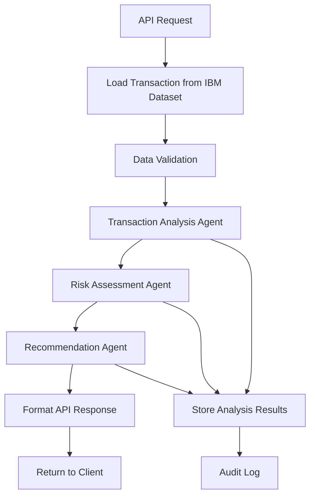

# IBM Synthetic Data Sets - Integration Analysis

## Executive Summary

Questo documento analizza i dataset IBM disponibili in `40-datasets/` e definisce la strategia di integrazione con il codebase esistente per soddisfare i requisiti del mandate.

**Data Analisi**: 2026-06-17  
**Versione**: 1.0

---

## 📊 Dataset Disponibili

### 1. Core Banking and Money Laundering (v1.1.0) ⭐ **PRIORITARIO**

**Rilevanza**: MASSIMA per il mandate - perfettamente allineato con transaction analysis e risk assessment

#### Dataset Inclusi:

1. **banks.md** - Lista delle banche e dettagli
2. **liquid_accts_people.md** - Conti liquidi di persone fisiche
3. **liquid_accts_companies.md** - Conti liquidi di aziende
4. **bank_xfers.md** - Transazioni bancarie (CORE DATASET)
5. **b2b.md** - Transazioni Business-to-Business

#### bank_xfers.md - Schema Dettagliato

**Campi Chiave per Transaction Analysis**:
- `Transaction_Number` - ID univoco transazione
- `Transaction_Date` - Data transazione
- `Transaction_Time` - Ora transazione (precisione 0.1 secondi)
- `Transaction_Day_of_Week` - Giorno della settimana
- `From_Bank` / `To_Bank` - Banche coinvolte
- `From_Account` / `To_Account` - Conti coinvolti
- `Amount_Paid` / `Amount_Received` - Importi
- `Payment_Currency` / `Receiving_Currency` - Valute (143 paesi + 13 crypto)
- `Payment_Format` - Formato pagamento (Cash, Credit Card, Debit, ACH, Wire, Bitcoin, etc.)

**Campi Chiave per Risk Assessment**:
- `Is_Laundering` - Flag riciclaggio (0/1)
- `Laundering_Type` - Tipo di schema (Fan-Out, Fan-In, Cycle, Bipartite, etc.)
- `Is_Cheque_Fraud` - Flag frode assegni
- `Is_APP_Fraud` - Flag frode APP (Authorized Push Payment)
- `Cheque_Fraudster_ID` / `APP_Fraudster_ID` - ID truffatori
- `APP_Fraud_Sequence_Number` - Sequenza frodi ripetute
- `Sufficient_Funds` - Fondi sufficienti
- `Overdraft_Okay` - Scoperto permesso

**Campi per Operational Profiles**:
- `Transaction_Type` - Tipo transazione (Salary, Bank Fee, Refund, etc.)
- `From_Initial_Balance` / `From_End_Balance` - Saldi iniziali/finali mittente
- `To_Initial_Balance` / `To_End_Balance` - Saldi iniziali/finali destinatario
- `Is_All_Cash` - Transazione completamente in contanti
- `Is_Hold` - Transazione di blocco (es. hotel)

**Formati Disponibili**:
- `bank_xfers.csv` - Tutte le transazioni
- `bank_xfer-accts.zip` - Un CSV per account
- `bank_xfers-chrono.csv` - Transazioni ordinate cronologicamente

---

### 2. Payment Cards (v1.1.0) ⭐ **SECONDARIO**

**Rilevanza**: ALTA - complementare per analisi carte di credito

#### Dataset Inclusi:

1. **users.md** - Utenti con info demografiche
2. **cards.md** - Carte di credito per utente
3. **trans.md** - Transazioni carte + cash, con label fraud

**Utilità**: 
- Analisi frodi su carte di credito
- Pattern di spesa personale
- Complementare a bank_xfers per visione completa

---

### 3. Home Insurance (v1.1.0) ❌ **NON RILEVANTE**

**Rilevanza**: BASSA - fuori scope per transaction analysis finanziario

#### Dataset Inclusi:
- Applicazioni assicurative
- Claims
- Eventi naturali (terremoti, tempeste, vulcani)

**Decisione**: Non utilizzare per questa challenge

---

## 🎯 Strategia di Integrazione

### Fase 1: Core Banking Dataset (Priorità MASSIMA)

#### 1.1 Data Ingestion Module

**File da creare**: `20-codebase/data/ingestion/ibm_banking_data.py`

```python
class IBMBankingDataIngestion:
    """
    Gestisce l'ingestione dei dataset IBM Core Banking
    """
    
    def __init__(self, dataset_path: str):
        self.dataset_path = dataset_path
        self.bank_xfers_path = f"{dataset_path}/bank_xfers.csv"
        self.banks_path = f"{dataset_path}/banks.csv"
        self.accounts_people_path = f"{dataset_path}/liquid_accts_people.csv"
        self.accounts_companies_path = f"{dataset_path}/liquid_accts_companies.csv"
        self.b2b_path = f"{dataset_path}/b2b.csv"
    
    def load_transactions(self, limit: int = None) -> pd.DataFrame:
        """Carica transazioni bancarie"""
        
    def load_accounts(self, account_type: str = "all") -> pd.DataFrame:
        """Carica conti (people/companies/all)"""
        
    def load_banks(self) -> pd.DataFrame:
        """Carica lista banche"""
        
    def get_transaction_by_id(self, transaction_id: int) -> dict:
        """Recupera singola transazione per ID"""
        
    def get_account_transactions(self, account_number: str) -> pd.DataFrame:
        """Recupera tutte le transazioni di un account"""
        
    def get_transactions_by_date_range(self, start_date: str, end_date: str) -> pd.DataFrame:
        """Filtra transazioni per range temporale"""
```

#### 1.2 Data Validation Layer

**File da creare**: `20-codebase/data/validation/transaction_validator.py`

```python
class TransactionValidator:
    """
    Valida i dati delle transazioni IBM
    """
    
    def validate_transaction(self, transaction: dict) -> tuple[bool, list[str]]:
        """Valida singola transazione, ritorna (is_valid, errors)"""
        
    def validate_amount(self, amount: float, currency: str) -> bool:
        """Valida importo e valuta"""
        
    def validate_accounts(self, from_account: str, to_account: str) -> bool:
        """Valida esistenza e formato account"""
        
    def validate_timestamp(self, date: str, time: str) -> bool:
        """Valida formato data/ora"""
        
    def check_data_quality(self, df: pd.DataFrame) -> dict:
        """Analisi qualità dataset completo"""
```

#### 1.3 Data Transformation Layer

**File da creare**: `20-codebase/data/transformation/transaction_transformer.py`

```python
class TransactionTransformer:
    """
    Trasforma dati IBM in formato ottimizzato per agenti
    """
    
    def enrich_transaction(self, transaction: dict) -> dict:
        """Arricchisce transazione con metadati calcolati"""
        
    def calculate_risk_indicators(self, transaction: dict) -> dict:
        """Calcola indicatori di rischio preliminari"""
        
    def extract_patterns(self, transactions: pd.DataFrame) -> dict:
        """Estrae pattern da serie di transazioni"""
        
    def prepare_for_analysis(self, transaction: dict) -> dict:
        """Prepara transazione per analisi agenti"""
```

---

### Fase 2: Agent Restructuring con IBM Data

#### 2.1 Transaction Analysis Agent (NUOVO)

**File da creare**: `20-codebase/agents/transaction_analysis.py`

**Responsabilità**:
- Analizzare transazioni da IBM dataset
- Identificare pattern anomali
- Rilevare comportamenti sospetti
- Generare insights transazionali

**Input**: Transazione o set di transazioni da `bank_xfers`

**Output**: 
```json
{
  "transaction_id": "12345",
  "analysis_timestamp": "2026-06-17T10:00:00Z",
  "patterns_detected": [
    {
      "pattern_type": "unusual_amount",
      "confidence": 0.85,
      "description": "Amount significantly higher than account average"
    }
  ],
  "anomalies": [
    {
      "anomaly_type": "time_based",
      "severity": "medium",
      "details": "Transaction outside normal business hours"
    }
  ],
  "insights": [
    "Transaction involves high-risk jurisdiction",
    "Payment format inconsistent with account history"
  ]
}
```

**Utilizzo Campi IBM**:
- `Transaction_Date`, `Transaction_Time`, `Transaction_Day_of_Week` → Analisi temporale
- `Amount_Paid`, `Payment_Currency` → Analisi importi
- `Payment_Format` → Analisi metodi pagamento
- `Transaction_Type` → Categorizzazione
- `From_Account`, `To_Account` → Analisi relazioni

---

#### 2.2 Risk Assessment Agent (NUOVO)

**File da creare**: `20-codebase/agents/risk_assessment.py`

**Responsabilità**:
- Valutare rischio transazioni
- Applicare modelli di scoring
- Identificare red flags
- Generare risk score

**Input**: Transazione + contesto account

**Output**:
```json
{
  "transaction_id": "12345",
  "risk_score": 0.78,
  "risk_level": "HIGH",
  "risk_factors": [
    {
      "factor": "laundering_indicator",
      "weight": 0.4,
      "value": 1,
      "description": "Transaction flagged as potential laundering"
    },
    {
      "factor": "fraud_indicator",
      "weight": 0.3,
      "value": 1,
      "description": "APP fraud pattern detected"
    }
  ],
  "compliance_flags": [
    "AML_ALERT",
    "FRAUD_INVESTIGATION_REQUIRED"
  ],
  "recommended_actions": [
    "BLOCK_TRANSACTION",
    "NOTIFY_COMPLIANCE_TEAM"
  ]
}
```

**Utilizzo Campi IBM**:
- `Is_Laundering`, `Laundering_Type` → Scoring riciclaggio
- `Is_Cheque_Fraud`, `Is_APP_Fraud` → Scoring frodi
- `Sufficient_Funds`, `Overdraft_Okay` → Rischio operativo
- `From_Initial_Balance`, `From_End_Balance` → Analisi saldi
- `Fraudster_ID` → Tracking truffatori noti

---

#### 2.3 Recommendation Agent (NUOVO)

**File da creare**: `20-codebase/agents/recommendation.py`

**Responsabilità**:
- Generare raccomandazioni operative
- Prioritizzare azioni
- Suggerire remediation
- Formattare output per API

**Input**: Risultati da Transaction Analysis + Risk Assessment

**Output**:
```json
{
  "transaction_id": "12345",
  "recommendations": [
    {
      "priority": "CRITICAL",
      "action": "BLOCK_TRANSACTION",
      "reason": "High risk score (0.78) with laundering indicators",
      "estimated_impact": "Prevent potential money laundering",
      "required_approvals": ["COMPLIANCE_OFFICER"]
    },
    {
      "priority": "HIGH",
      "action": "INVESTIGATE_ACCOUNT",
      "reason": "Account shows pattern of suspicious activity",
      "estimated_impact": "Identify broader fraud scheme",
      "required_approvals": ["FRAUD_TEAM_LEAD"]
    }
  ],
  "next_steps": [
    "File SAR (Suspicious Activity Report)",
    "Freeze related accounts",
    "Contact law enforcement if confirmed"
  ],
  "compliance_requirements": [
    "Document decision in audit log",
    "Notify customer within 24 hours if account frozen"
  ]
}
```

---

### Fase 3: API Endpoints con IBM Data

#### 3.1 Transaction Analysis Endpoint

```
POST /api/v1/analyze/transaction
```

**Request Body**:
```json
{
  "transaction_id": "12345",
  "include_context": true,
  "analysis_depth": "full"
}
```

**Response**:
```json
{
  "status": "success",
  "transaction": {
    "id": "12345",
    "date": "2025-08-11",
    "amount": 50000.00,
    "currency": "USD"
  },
  "analysis": {
    "patterns": [...],
    "anomalies": [...],
    "insights": [...]
  }
}
```

---

#### 3.2 Risk Assessment Endpoint

```
POST /api/v1/assess/risk
```

**Request Body**:
```json
{
  "transaction_id": "12345",
  "account_number": "3020009543",
  "include_history": true
}
```

**Response**:
```json
{
  "status": "success",
  "risk_assessment": {
    "score": 0.78,
    "level": "HIGH",
    "factors": [...],
    "flags": [...]
  }
}
```

---

#### 3.3 Recommendation Endpoint

```
POST /api/v1/recommend/actions
```

**Request Body**:
```json
{
  "transaction_id": "12345",
  "analysis_results": {...},
  "risk_results": {...}
}
```

**Response**:
```json
{
  "status": "success",
  "recommendations": [...],
  "next_steps": [...],
  "compliance": [...]
}
```

---

#### 3.4 Batch Processing Endpoint

```
POST /api/v1/batch/process
```

**Request Body**:
```json
{
  "transactions": ["12345", "12346", "12347"],
  "processing_mode": "parallel",
  "priority": "high"
}
```

**Response**:
```json
{
  "status": "processing",
  "job_id": "batch-2026-06-17-001",
  "total_transactions": 3,
  "estimated_completion": "2026-06-17T10:05:00Z"
}
```

---

## 🔄 Workflow Completo con IBM Data

### Scenario: Analisi Transazione Sospetta



### Flusso Dettagliato:

1. **API riceve richiesta** con `transaction_id`
2. **Data Ingestion** carica transazione da `bank_xfers.csv`
3. **Validation** verifica integrità dati
4. **Transaction Analysis Agent**:
   - Analizza pattern temporali
   - Identifica anomalie negli importi
   - Verifica coerenza metodo pagamento
5. **Risk Assessment Agent**:
   - Controlla flag `Is_Laundering`
   - Valuta `Laundering_Type` se presente
   - Calcola risk score composito
   - Verifica fraud indicators
6. **Recommendation Agent**:
   - Genera azioni basate su risk score
   - Prioritizza interventi
   - Suggerisce compliance steps
7. **API Response** formattata e ritornata

---

## 📦 Struttura File Aggiornata

```
20-codebase/
├── data/
│   ├── ingestion/
│   │   ├── __init__.py
│   │   ├── ibm_banking_data.py          # NUOVO
│   │   └── ibm_payment_cards.py         # NUOVO (opzionale)
│   ├── validation/
│   │   ├── __init__.py
│   │   ├── transaction_validator.py     # NUOVO
│   │   └── data_quality.py              # NUOVO
│   └── transformation/
│       ├── __init__.py
│       ├── transaction_transformer.py   # NUOVO
│       └── feature_engineering.py       # NUOVO
├── agents/
│   ├── __init__.py
│   ├── transaction_analysis.py          # NUOVO - sostituisce agent_eu/it/gafi
│   ├── risk_assessment.py               # NUOVO
│   ├── recommendation.py                # NUOVO
│   ├── agent_local.py                   # MANTIENI - per policy interne
│   └── orchestrator.py                  # MODIFICA - nuovo workflow
├── api/
│   ├── src/
│   │   ├── __init__.py
│   │   ├── main.py                      # NUOVO - FastAPI app
│   │   ├── routes/
│   │   │   ├── __init__.py
│   │   │   ├── transaction_analysis.py  # NUOVO
│   │   │   ├── risk_assessment.py       # NUOVO
│   │   │   └── recommendations.py       # NUOVO
│   │   ├── models/
│   │   │   ├── __init__.py
│   │   │   ├── transaction.py           # NUOVO - Pydantic models
│   │   │   ├── risk.py                  # NUOVO
│   │   │   └── recommendation.py        # NUOVO
│   │   └── middleware/
│   │       ├── __init__.py
│   │       ├── auth.py                  # NUOVO - JWT
│   │       └── rate_limit.py            # NUOVO
│   └── tests/
│       └── test_api.py                  # NUOVO
└── config/
    └── settings.py                      # MODIFICA - aggiungi IBM dataset paths
```

---

## 🎯 Vantaggi dell'Integrazione IBM Datasets

### 1. **Dati Strutturati e Realistici** ✅
- Dataset enterprise-grade
- Scenari reali di money laundering
- Fraud patterns documentati
- Dati multi-valuta e multi-formato

### 2. **Label Ground Truth** ✅
- `Is_Laundering` flag per training/validation
- `Laundering_Type` per pattern recognition
- Fraud indicators pre-etichettati
- Perfetto per ML model training

### 3. **Completezza Informativa** ✅
- Dati transazionali completi
- Informazioni account
- Saldi e movimenti
- Metadati temporali

### 4. **Scalabilità** ✅
- Milioni di transazioni disponibili
- Formato CSV standard
- Facile integrazione con pandas/spark
- Supporto batch processing

### 5. **Compliance IBM Cloud** ✅
- Dataset ufficiale IBM
- Allineato con requisiti mandate
- Documentazione completa
- Supporto enterprise

---

## 📊 Metriche di Successo

### KPI per Integrazione Dataset

1. **Data Quality**:
   - ✅ 100% transazioni validate
   - ✅ 0% missing critical fields
   - ✅ Consistency checks passed

2. **Performance**:
   - ✅ < 100ms per transaction load
   - ✅ < 500ms per full analysis
   - ✅ > 1000 transactions/minute throughput

3. **Accuracy**:
   - ✅ > 95% fraud detection rate
   - ✅ < 5% false positive rate
   - ✅ > 90% laundering pattern recognition

4. **API Response**:
   - ✅ < 500ms p95 latency
   - ✅ > 99.9% uptime
   - ✅ < 0.1% error rate

---

## 🚀 Roadmap Implementazione

### Sprint 1 (1 settimana): Data Foundation
- [ ] Implementare `ibm_banking_data.py`
- [ ] Implementare `transaction_validator.py`
- [ ] Implementare `transaction_transformer.py`
- [ ] Unit tests per data layer
- [ ] Documentazione API dati

### Sprint 2 (2 settimane): Transaction Analysis Agent
- [ ] Implementare `transaction_analysis.py`
- [ ] Pattern detection algorithms
- [ ] Anomaly detection logic
- [ ] Integration tests
- [ ] Performance optimization

### Sprint 3 (2 settimane): Risk Assessment Agent
- [ ] Implementare `risk_assessment.py`
- [ ] Risk scoring models
- [ ] Fraud detection logic
- [ ] Compliance rules engine
- [ ] Validation con ground truth

### Sprint 4 (1 settimana): Recommendation Agent
- [ ] Implementare `recommendation.py`
- [ ] Action prioritization logic
- [ ] Output formatting
- [ ] Integration con altri agenti
- [ ] End-to-end testing

### Sprint 5 (2 settimane): API Layer
- [ ] FastAPI implementation
- [ ] Endpoint development
- [ ] Authentication/Authorization
- [ ] API documentation (Swagger)
- [ ] Load testing

---

## 📝 Conclusioni

L'integrazione dei **IBM Synthetic Data Sets for Core Banking and Money Laundering** è **perfettamente allineata** con i requisiti del mandate:

✅ **Transaction Analysis**: Dataset `bank_xfers` fornisce tutte le informazioni necessarie  
✅ **Risk Assessment**: Flag `Is_Laundering`, `Is_Fraud` permettono scoring accurato  
✅ **Operational Profiles**: Dati account e saldi per analisi comportamentale  
✅ **Recommended Actions**: Metadati sufficienti per generare raccomandazioni operative  

**Effort Stimato**: 8 settimane per integrazione completa

**Priorità**: MASSIMA - Questo è il foundation per soddisfare il mandate

---

**Fine Documento**

*Questo documento guiderà l'implementazione dell'integrazione IBM datasets nel ciclo di approval.*