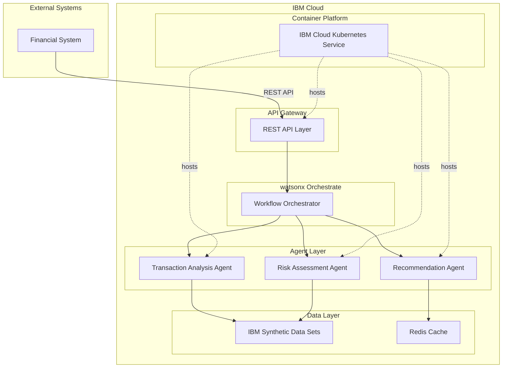
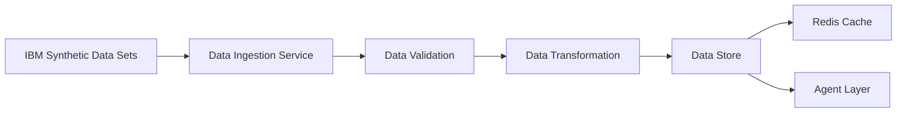
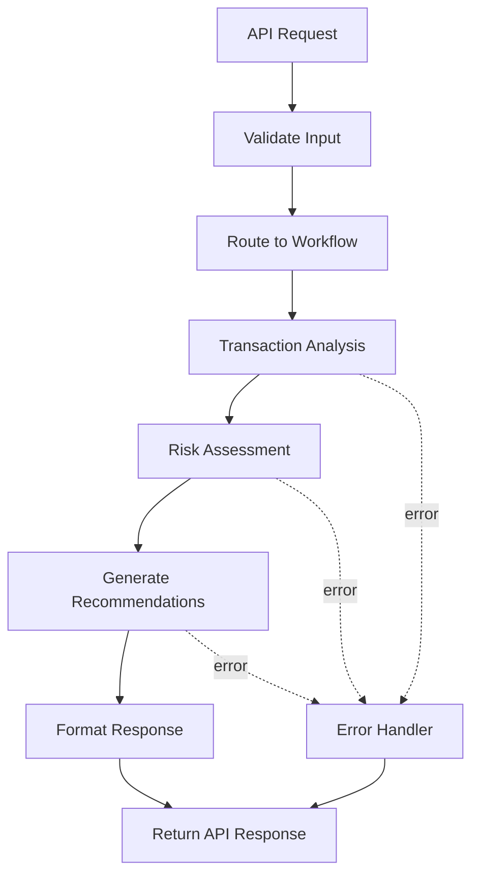
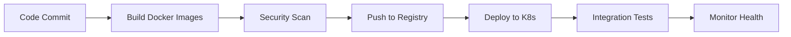

# IBM Cloud Deployment Strategy

## Executive Summary

This document outlines the deployment strategy for the containerized agentic application on IBM Cloud, leveraging watsonx Orchestrate for agent workflow management and IBM Synthetic Data Sets for financial transaction analysis.

## Architecture Overview



## Deployment Phases

### Phase 1: Infrastructure Setup
**Duration**: 1-2 weeks

#### IBM Cloud Services Configuration
- **IBM Cloud Kubernetes Service (IKS)**: Container orchestration platform
- **IBM Cloud Container Registry**: Private Docker image repository
- **IBM Cloud Object Storage**: Persistent data storage
- **IBM Cloud Databases for Redis**: Caching layer
- **IBM Cloud Monitoring**: Application and infrastructure monitoring
- **IBM Cloud Logging**: Centralized log management

#### watsonx Orchestrate Setup
- Create watsonx Orchestrate instance
- Configure authentication and authorization
- Set up skill catalog for agent integration
- Define workflow templates

#### Network Configuration
- Configure Virtual Private Cloud (VPC)
- Set up security groups and network ACLs
- Configure load balancer for API gateway
- Establish VPN for secure access

### Phase 2: Data Integration
**Duration**: 1-2 weeks

#### IBM Synthetic Data Sets Integration
- Identify required synthetic datasets for financial transactions
- Configure data access credentials and permissions
- Implement data ingestion pipelines
- Set up data validation and quality checks
- Create data transformation layer for agent consumption

#### Data Architecture


### Phase 3: Agent Development
**Duration**: 3-4 weeks

#### Transaction Analysis Agent
**Responsibilities**:
- Parse and normalize transaction data
- Identify transaction patterns and trends
- Detect anomalies and unusual behaviors
- Generate transaction insights

**Technology Stack**:
- Python 3.11+ with FastAPI
- Pandas for data manipulation
- Scikit-learn for pattern detection
- Docker containerization

#### Risk Assessment Agent
**Responsibilities**:
- Evaluate transaction risk scores
- Apply risk models and rules
- Assess operational profile risks
- Generate risk reports

**Technology Stack**:
- Python 3.11+ with FastAPI
- NumPy for numerical computations
- Custom risk scoring algorithms
- Docker containerization

#### Recommendation Agent
**Responsibilities**:
- Analyze results from other agents
- Generate actionable recommendations
- Prioritize recommendations by impact
- Format output for API consumption

**Technology Stack**:
- Python 3.11+ with FastAPI
- Rule-based recommendation engine
- Template-based report generation
- Docker containerization

### Phase 4: Orchestration Layer
**Duration**: 2-3 weeks

#### watsonx Orchestrate Workflow Design


#### Workflow Configuration
- Define agent skill mappings in watsonx Orchestrate
- Configure workflow triggers and conditions
- Implement error handling and retry logic
- Set up workflow monitoring and alerting

### Phase 5: API Layer Development
**Duration**: 2 weeks

#### REST API Endpoints

**Transaction Analysis Endpoint**
```
POST /api/v1/analyze/transaction
Request: Transaction data payload
Response: Analysis results with insights
```

**Risk Assessment Endpoint**
```
POST /api/v1/assess/risk
Request: Transaction and profile data
Response: Risk score and assessment details
```

**Recommendation Endpoint**
```
POST /api/v1/recommend/actions
Request: Analysis and risk assessment results
Response: Prioritized recommendations
```

**Batch Processing Endpoint**
```
POST /api/v1/batch/process
Request: Multiple transactions
Response: Batch processing job ID and status
```

#### API Features
- OpenAPI/Swagger documentation
- JWT-based authentication
- Rate limiting and throttling
- Request validation and sanitization
- Comprehensive error handling
- CORS configuration for web integration

### Phase 6: Containerization
**Duration**: 1-2 weeks

#### Docker Configuration

**Base Image Strategy**:
- Use official Python 3.11-slim base image
- Multi-stage builds for optimized image size
- Security scanning with IBM Cloud Vulnerability Advisor

**Container Structure**:
```
containers/
├── transaction-agent/
│   ├── Dockerfile
│   ├── requirements.txt
│   └── src/
├── risk-agent/
│   ├── Dockerfile
│   ├── requirements.txt
│   └── src/
├── recommendation-agent/
│   ├── Dockerfile
│   ├── requirements.txt
│   └── src/
└── api-gateway/
    ├── Dockerfile
    ├── requirements.txt
    └── src/
```

#### Kubernetes Manifests
- Deployment configurations for each agent
- Service definitions for inter-agent communication
- ConfigMaps for environment-specific settings
- Secrets for sensitive credentials
- Horizontal Pod Autoscaler (HPA) for scaling
- Ingress configuration for external access

### Phase 7: Deployment and Testing
**Duration**: 2-3 weeks

#### Deployment Pipeline


#### Testing Strategy
- **Unit Tests**: Individual agent functionality
- **Integration Tests**: Agent-to-agent communication
- **API Tests**: REST endpoint validation
- **Load Tests**: Performance under stress
- **Security Tests**: Vulnerability assessment
- **End-to-End Tests**: Complete workflow validation

#### Monitoring and Observability
- Application metrics with Prometheus
- Distributed tracing with Jaeger
- Log aggregation with IBM Cloud Logging
- Custom dashboards in Grafana
- Alert configuration for critical events

## Security Considerations

### Authentication and Authorization
- IBM Cloud IAM for service authentication
- JWT tokens for API authentication
- Role-based access control (RBAC) in Kubernetes
- Service-to-service authentication with mTLS

### Data Security
- Encryption at rest for stored data
- Encryption in transit with TLS 1.3
- Secure credential management with IBM Cloud Secrets Manager
- Data masking for sensitive information
- Audit logging for compliance

### Network Security
- Private endpoints for internal communication
- Web Application Firewall (WAF) for API protection
- DDoS protection with IBM Cloud Internet Services
- Network segmentation with VPC
- Regular security assessments and penetration testing

## Scalability Strategy

### Horizontal Scaling
- Kubernetes HPA based on CPU/memory metrics
- Custom metrics scaling based on queue depth
- Auto-scaling for API gateway layer
- Load balancing across agent instances

### Performance Optimization
- Redis caching for frequently accessed data
- Connection pooling for database access
- Asynchronous processing for long-running tasks
- CDN for static content delivery
- Database query optimization

## Disaster Recovery and High Availability

### High Availability
- Multi-zone deployment in IBM Cloud
- Redundant instances for each agent
- Database replication across zones
- Load balancer health checks
- Automatic failover mechanisms

### Backup and Recovery
- Automated daily backups to IBM Cloud Object Storage
- Point-in-time recovery capability
- Backup retention policy (30 days)
- Regular disaster recovery drills
- Documented recovery procedures

## Cost Optimization

### Resource Management
- Right-sizing of container resources
- Spot instances for non-critical workloads
- Auto-scaling to match demand
- Reserved capacity for predictable workloads
- Regular cost analysis and optimization

### Monitoring and Alerts
- Cost tracking dashboards
- Budget alerts and notifications
- Resource utilization reports
- Optimization recommendations

## Rollout Timeline

| Phase | Duration | Key Deliverables |
|-------|----------|------------------|
| Phase 1: Infrastructure | 1-2 weeks | IBM Cloud setup, K8s cluster, watsonx Orchestrate |
| Phase 2: Data Integration | 1-2 weeks | Data pipelines, validation, transformation |
| Phase 3: Agent Development | 3-4 weeks | Three specialized agents containerized |
| Phase 4: Orchestration | 2-3 weeks | watsonx workflows, error handling |
| Phase 5: API Layer | 2 weeks | REST APIs, documentation, authentication |
| Phase 6: Containerization | 1-2 weeks | Docker images, K8s manifests |
| Phase 7: Deployment & Testing | 2-3 weeks | CI/CD pipeline, testing, monitoring |
| **Total** | **12-18 weeks** | **Production-ready system** |

## Success Metrics

### Technical Metrics
- API response time < 500ms (p95)
- System uptime > 99.9%
- Agent processing throughput > 1000 transactions/minute
- Error rate < 0.1%
- Container startup time < 30 seconds

### Business Metrics
- Successful integration with financial systems
- Accurate risk assessment (>95% accuracy)
- Actionable recommendations generated
- Compliance with financial industry standards
- User satisfaction score > 4.5/5

## Risk Mitigation

| Risk | Impact | Mitigation Strategy |
|------|--------|---------------------|
| IBM Cloud service outage | High | Multi-zone deployment, failover procedures |
| Data quality issues | Medium | Validation layer, data quality monitoring |
| Performance bottlenecks | Medium | Load testing, performance optimization |
| Security vulnerabilities | High | Regular security scans, penetration testing |
| Integration challenges | Medium | Early integration testing, API versioning |
| Cost overruns | Medium | Budget monitoring, resource optimization |

## Next Steps

1. Review and approve this strategy document
2. Provision IBM Cloud resources
3. Set up development and staging environments
4. Begin Phase 1 implementation
5. Establish regular progress review meetings

## References

- [IBM Cloud Documentation](https://cloud.ibm.com/docs)
- [watsonx Orchestrate Documentation](https://www.ibm.com/docs/en/watsonx/watson-orchestrate)
- [IBM Synthetic Data Sets](https://www.ibm.com/products/synthetic-data)
- [Kubernetes Best Practices](https://kubernetes.io/docs/concepts/)